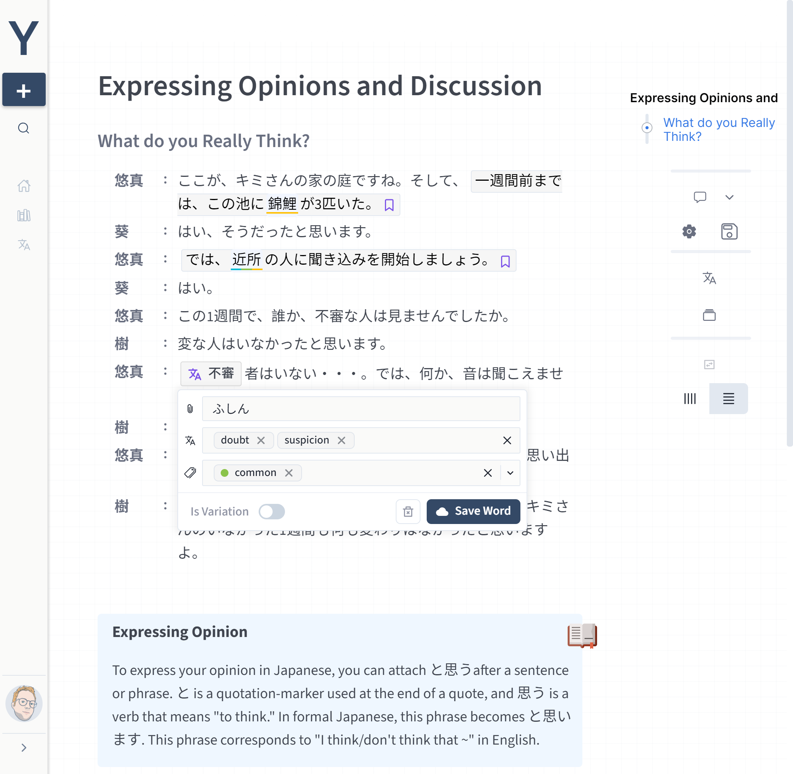
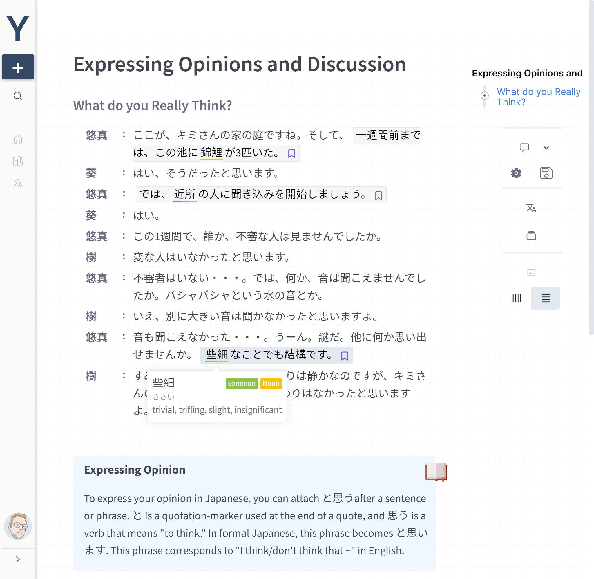
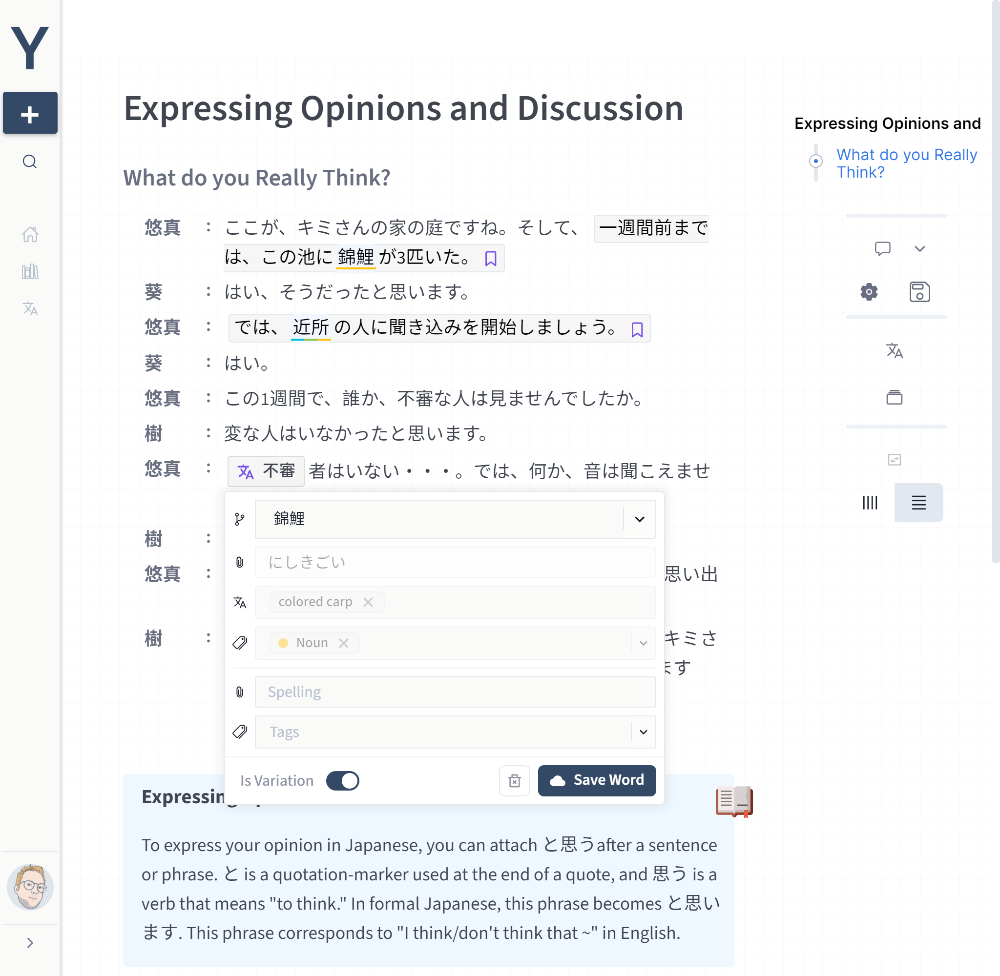
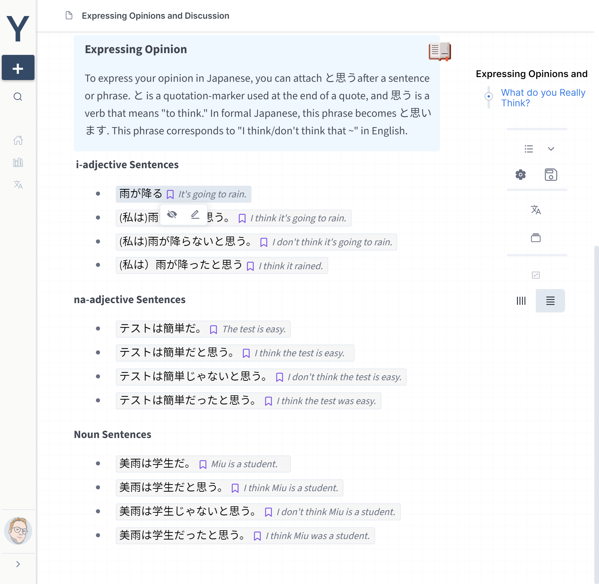
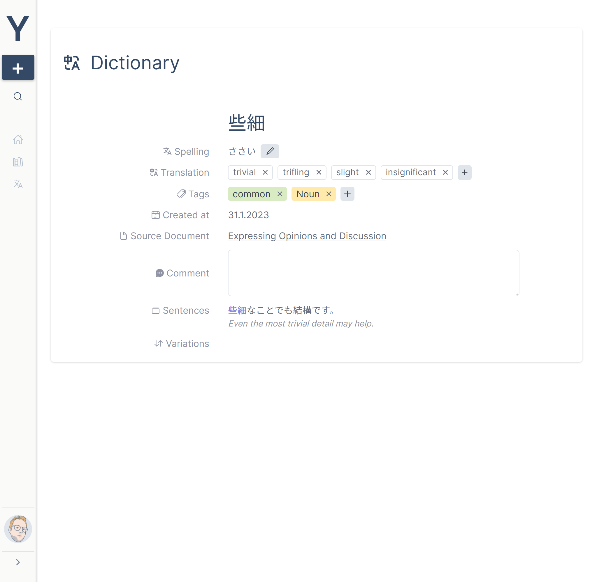
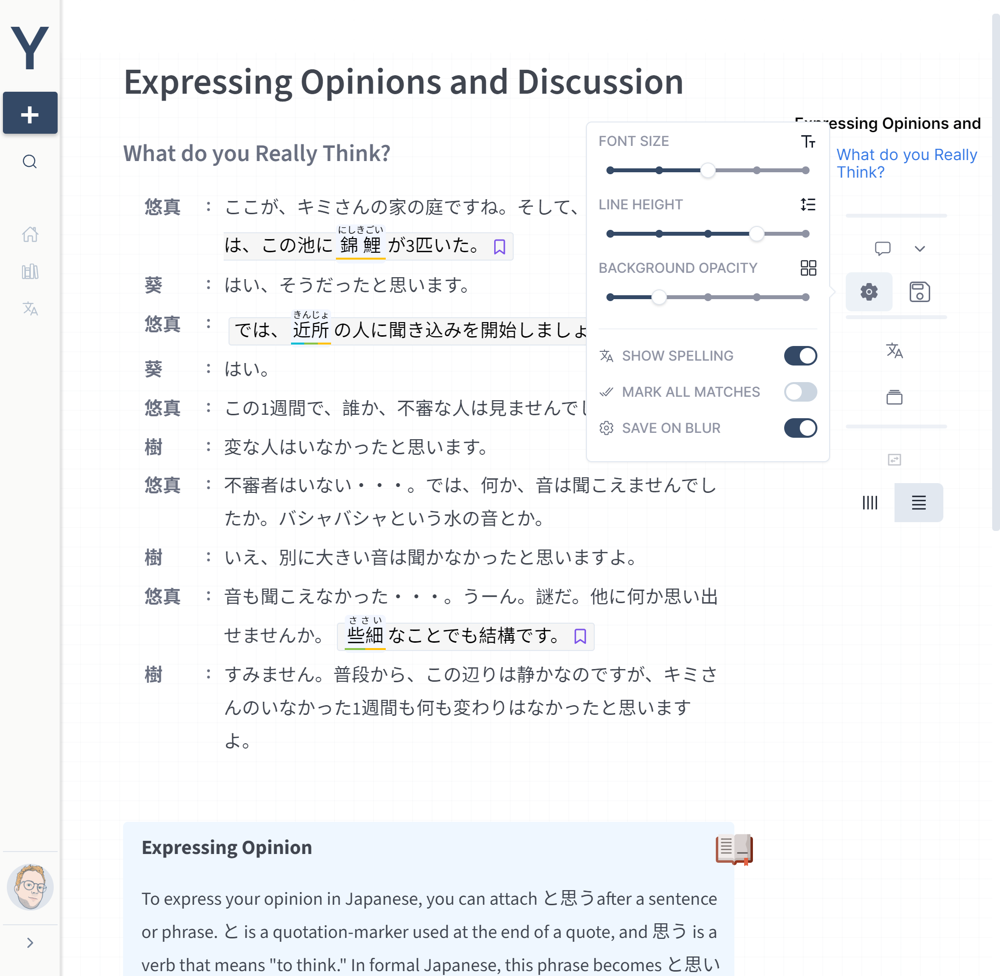

# YiLang 2.0

YiLang 2.0 helps you build a knowledge graph for the languages you are learning.

# Build with

- The Editor is build on top of [Lexical](https://github.com/facebook/lexical) with custom plugins.

- The Frontend is build on top of [next.js](https://github.com/vercel/next.js), [tRPC](https://github.com/trpc/trpc) and [react-query](https://github.com/TanStack/query).

- Authentication thanks to [NextAuth.js](https://github.com/nextauthjs/next-auth)

- The UI is a mix of [ Chakra ](https://github.com/chakra-ui/chakra-ui) and [ Tailwindcss ](https://github.com/tailwindlabs/tailwindcss)

- The Backend uses [ prisma ](https://github.com/prisma/prisma) for database operations and tRPC for client communication.

  - You can use any database you like. I currently use the PostgreSQL service from supabase.

- Images are uploaded to an S3 bucket through supabase.

- Backend as well as Frontend hosted on [Vercel](https://vercel.com/)

# Basics

## Home

## Adding Vocabulary

After creating a new Document by clicking on the + Button on the sidebar, select the word you want to add to your language database. Enter the relative values and save.

YiLang will insert the word, and you will be able to see all relevant information by clicking on the word node.

## Related Vocabulary

Sometimes you want to add vocabulary with different roots and or some form of conjugation.
For example, _He ran very fast_. You might want to add **run** as the base vocabulary and mark **ran** as the simple past of the root. You can do this by switching the _is Variation_ toggle at the bottom.

Select the root, or create a new one, and add the tags and spelling of the variation.

## Adding Sentences

Select the sentence you want to add and mark it as a sentence. Afterward, you get the option to show/hide and edit the translation. The Sentence is automatically added as an example for every containing vocabulary. You can also add additional vocabulary inside the sentence, as explained above.

## Dictionary Entry

The dictionary entry page displays all data for the vocabulary. You can edit the vocabulary, see where it first occurred (source document), see every example sentence and all variations.

## Settings

You can adjust font size and line height in the settings menu, toggle spelling and other editor settings.

# Block Elements

Additionally, you have a few block level elements to structure your data better.

- Dialogue
  - Use this for any dialogue you might encounter. You can also enter your dialogue in the form of speaker : speech separated by new lines. YiLang will parse this automatically to a dialogue block.
- Grammarpoint
  - Use this block to summarize some important grammar. YiLang will index all grammar points and make them available in the search.
- Remark
  - This can be used for example for cultural insights or any other important highlight.
- Two column layout
  - YiLang defaults to a one column layout, you can freely switch to a two column layout on a block basis.
